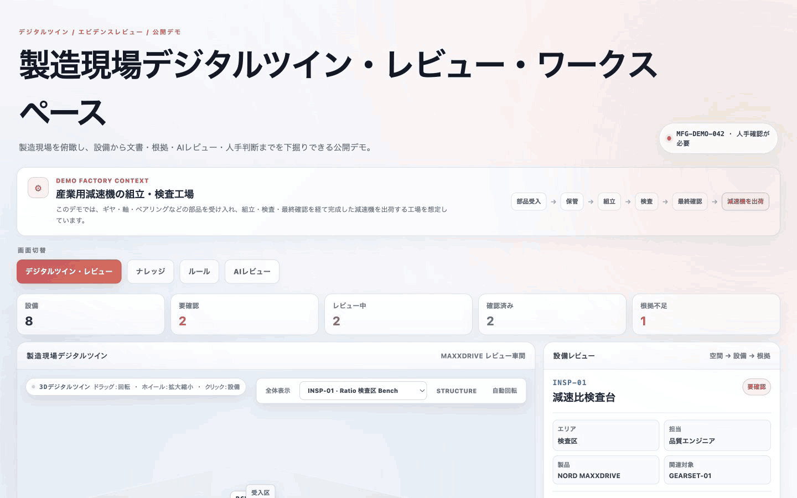
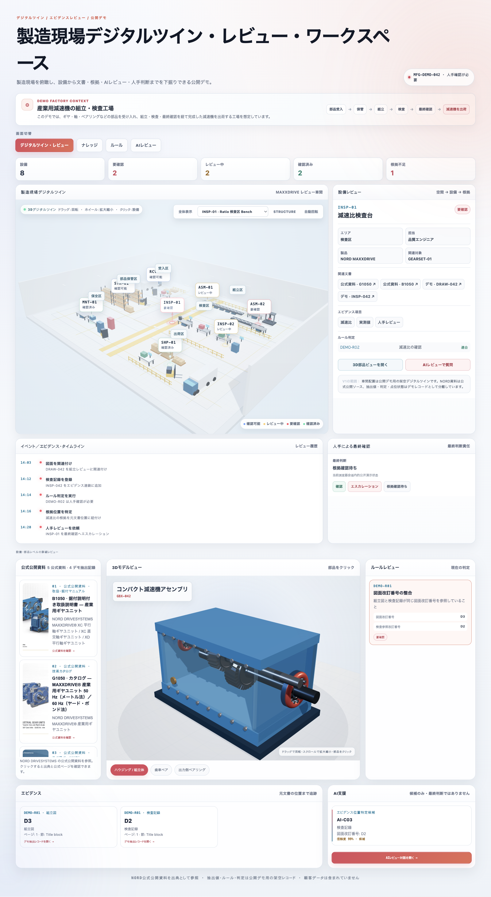
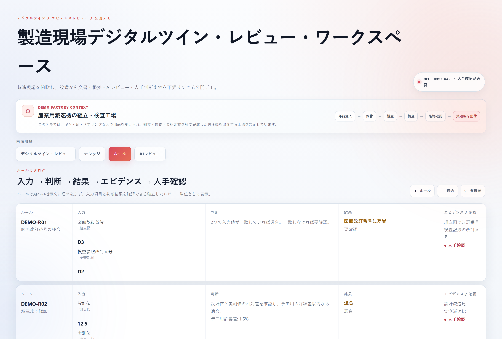
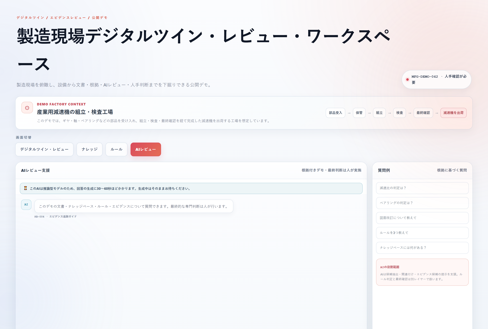
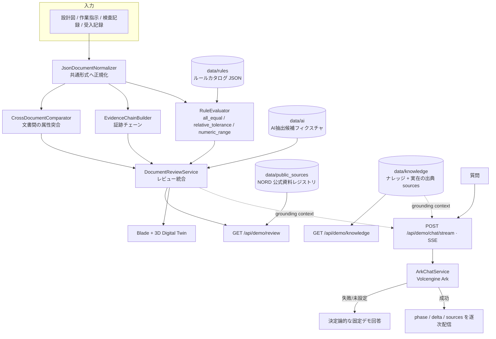
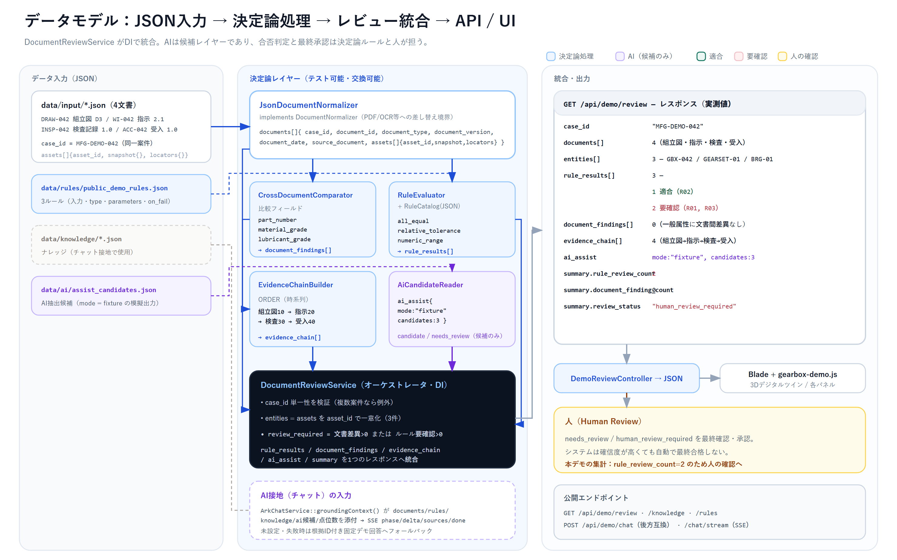
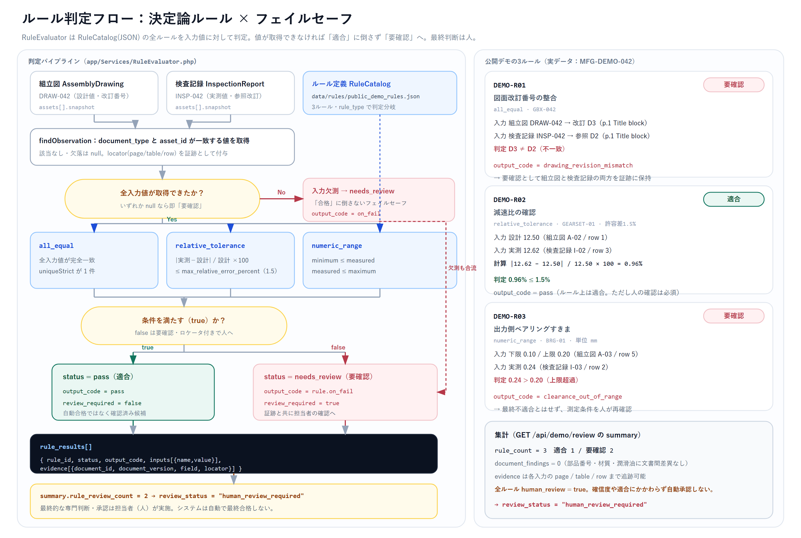

# Technical Document Review Demo

製造業の技術文書（設計図・作業指示・検査記録・受入記録）を同一案件として束ね、**決定論的なルールとエビデンスで判定し、AIは候補と説明の支援に留め、最終判断は人が行う**——その責任境界を、実装とUIの両方で示す Laravel 製の公開デモです。

> **AIに判定は任せない。** AI の出力の後ろに、ルール・証跡・人手確認という別レイヤーがあります。

**言語 / Language:** 日本語（本ファイル）・[中文](README.zh-CN.md)

---

## 動作デモ（約18秒）



*デジタルツイン（3D工場・ギアボックス・書類・証跡）をスクロール → ルールカタログ → AIレビュー支援。思考フェーズの後、出典ID付きの回答を SSE で逐次表示*

---

## 画面イメージ



*デジタルツインを空間の入口として、設備・工程・文書・ルール・エビデンスを横断表示*



*ルールは「入力 → 判断 → 結果 → エビデンス → 人手確認」の独立したレビュー単位*



*AI は根拠ID付きで回答する支援レイヤー。思考フェーズを経て SSE で回答を逐次表示*

---

## なぜこの構成か

製造現場では、AI による項目抽出や関連付けは便利ですが、**その出力をそのまま合否判定に使うと責任所在が曖昧になります**。このデモでは各レイヤーの責務を分離しています。

| レイヤー | 役割 | 実装 |
| --- | --- | --- |
| **AI** | 非構造文書からの項目抽出候補、同一部品への紐付け候補、エビデンス位置候補、説明文の草稿 | `AiCandidateReader`（候補フィクスチャ）、`ArkChatService`（実モデル接続） |
| **決定論ルール** | 合否の判定、文書間の値の突合、証跡の構築 | `RuleEvaluator`、`CrossDocumentComparator`、`EvidenceChainBuilder` |
| **人（Human Review）** | 要確認項目の最終的な専門判断・承認 | UI上で `needs_review` / `human_review_required` を明示 |

AI 候補には `confidence` と `status`（例: `candidate` / `needs_review`）があり、確信度が高くても自動承認はされません。ルールは入力値を取得できない場合、「合格」ではなく「要確認」に倒します。

---

## アーキテクチャ



### データモデルと統合



*JSON 入力を正規化し、文書間比較・ルール判定・証跡チェーン・AI候補を `DocumentReviewService` が1レスポンスへ統合。図中のフィールド・件数・数値はすべて実データ（`GET /api/demo/review` の実測値）と一致します。*

### 判定フロー



*`RuleEvaluator` は入力値を取得できない場合に「適合」へ倒さず「要確認」へ分岐。`all_equal` / `relative_tolerance` / `numeric_range` の判定と、公開デモ3ルールの実数値（R01: D3≠D2、R02: 誤差0.96%≦1.5%、R03: 0.24＞上限0.20）を示します。*

```text
Document → AI抽出候補（候補のみ・人が確認）→ Normalize（共通形式）
  → Rule / Compare（決定論判定）→ Finding（要確認の構造化）
  → Evidence（元文書の page / table / row まで追跡）→ Human Review（最終判断は人）
```

---

## コードマップ

| ファイル | 責務 |
| --- | --- |
| `app/Contracts/DocumentNormalizer.php` | 入力文書を共通形式へ整えるインターフェース。PDF/別形式への差し替え点 |
| `app/Services/JsonDocumentNormalizer.php` | JSON 実装。任意項目に安全な既定値を付与 |
| `app/Services/CrossDocumentComparator.php` | 部品番号・材質・潤滑油などの**一般属性**を文書横断で突合 |
| `app/Services/RuleEvaluator.php` | ルール定義に基づく**専門判定**。判定ロジックを比較処理から分離 |
| `app/Services/RuleCatalog.php` | ルールをデータ（JSON）として提供。ルール追加 = コード変更なし |
| `app/Services/EvidenceChainBuilder.php` | 設計図→指示→検査→受入の順序で証跡を構築 |
| `app/Services/AiCandidateReader.php` | `data/ai/assist_candidates.json`（`mode: fixture`）を読むリーダー。実抽出サービスへの差し替え点 |
| `app/Services/DocumentReviewService.php` | 上記をDIで統合するオーケストレータ |
| `app/Http/Controllers/DemoReviewController.php` | `GET /api/demo/review`。4文書を固定順で読み込み、レビュー結果に NORD 公式資料レジストリ（`public_sources`）を添付 |
| `app/Http/Controllers/DemoKnowledgeController.php` | `GET /api/demo/knowledge`。ナレッジとその出典（`sources`）を返却 |
| `app/Http/Controllers/DemoRuleCatalogController.php` | `GET /api/demo/rules`。ルールカタログ JSON を返却 |
| `app/Services/ArkChatService.php` | 実LLMクライアント（非ストリーム/ストリーム両対応）。キーはサーバー側のみ、接地文脈を付与 |
| `app/Http/Controllers/DemoChatController.php` | JSON 版チャット。AI失敗時は固定デモ回答へフォールバック |
| `app/Http/Controllers/DemoChatStreamController.php` | SSE 版チャット。phase / delta / sources / done を逐次配信し、失敗時も固定回答をストリーム配信 |
| `app/Services/DemoFallbackResponder.php` | キーワード連動の根拠ID付き固定回答を JSON / SSE で共用 |

### ルールエンジン

ルールはコードに埋め込まず、`data/rules/public_demo_rules.json` が唯一の定義元です。判定器は3種の汎用ルールタイプを持ちます。

- `all_equal` … 複数文書の値が完全一致するか（例: 図面改訂番号 D3 と D2）
- `relative_tolerance` … 設計値と実測値の相対誤差が許容値以内か（例: 1.5%）
- `numeric_range` … 実測値が下限・上限の範囲内か（例: ベアリングすきま 0.10〜0.20 mm）

各判定結果は入力値・出力コード・エビデンス（`document_id`, `field`, `locator`）を保持し、元文書の位置まで戻って確認できます。

---

## AI の使い方と境界

- **接地（グラウンディング）**: `ArkChatService::groundingContext()` は、文書・ナレッジ・ルール・AI候補・デジタルツイン点位数をプロンプトに添付し、システムプロンプトで「提示資料だけを根拠にする」「根拠がなければ確認できないと明言する」を強制します。ナレッジの方法論は ISO/JIS と NORD 公式資料への出典（`sources`）付きで、架空レコードとは明示的に区別します。
- **キーの扱い**: API キーはサーバー側の環境変数からのみ読み込み、クライアントへは一切送出しません。応答・ページ・ログのいずれにも現れないことを `ApiKeyConfidentialityTest` で確認しています。上流がエラーメッセージへ鍵をエコーした場合も、ログへ書く前に伏せます。
- **失敗時の挙動**: LLM 未設定・接続失敗・タイムアウト時は、`DemoChatController` が**根拠ID付きの固定デモ回答**へフォールバックします。オフラインでもデモが破綻しません。
- **抽出候補はフィクスチャ**: `data/ai/assist_candidates.json` は `mode: fixture` の模擬出力です。これは実モデル出力ではなく、「AI候補が入ってきた後にルールと証跡がどう挟まるか」を示すための境界（シーム）です。実運用ではこのファイルを実抽出サービスに置き換えます。
- **ストリーミング応答**: 推論型モデルは思考に時間を要するため、チャットは SSE 専用エンドポイント `POST /api/demo/chat/stream` を使い、`phase`（思考中）→ `delta`（本文を逐次）→ `sources`（根拠ID）→ `done` の順で配信します。思考段階から応答が始まるため無言で待たせず、未設定・失敗時は同じ固定デモ回答をストリーム配信します。後方互換として非ストリームの `POST /api/demo/chat` も残しています。

---

## ローカル実行

```bash
composer install
cp .env.example .env
php artisan key:generate
php artisan serve
# http://localhost:8000/demo
```

必要環境: PHP 8.2 以上（`mbstring`, `openssl`, `curl`, `fileinfo`）。

AI チャットを実モデルで動かす場合のみ `.env` に設定します。未設定なら固定デモ回答で動作します。

```dotenv
# 従量課金エンドポイント（個別モデルID）
ARK_API_KEY=...
ARK_MODEL=<your-model-or-endpoint-id>
ARK_BASE_URL=https://ark.cn-beijing.volces.com/api/v3

# Agent Plan（サブスクリプション）の場合
ARK_BASE_URL=https://ark.cn-beijing.volces.com/api/plan/v3
ARK_MODEL=ark-code-latest
ARK_TIMEOUT=60
```

> Windows で cURL の SSL 検証エラー（error 60）が出る場合は、公式の `cacert.pem` を取得し `php.ini` の `curl.cainfo` / `openssl.cafile` に設定してください。

### API

```text
GET  /api/demo/review     # 文書・ルール判定・ファインディング・証跡・AI候補
GET  /api/demo/knowledge  # ナレッジベース
GET  /api/demo/rules      # ルールカタログ
POST /api/demo/chat        # AIレビュー支援（JSON・後方互換、未設定時は固定回答）
POST /api/demo/chat/stream # AIレビュー支援（SSEストリーミング）
```

### テスト

```bash
composer test
```

ルールの公差境界（1.5% ちょうどで適合、1.6% で要確認）、範囲の上下限、入力欠測時の「要確認」フォールバック、証跡の順序、案件単位のバリデーション、正規化の既定値など、**ドメインの振る舞いを中心にカバー**しています。

---

## プロダクションへの差分（成長余地）

このデモは公開用に意図的に簡略化しています。実案件化する場合の主な差分は次の通りです。

- **RAG 化**: 現状は全データをプロンプトへ添付しています。文書が増えた場合のチャンク化・検索・参照IDの整合を導入
- **抽出の実体化**: `assist_candidates.json` を実際の抽出サービスへ置換、人による承認状態の永続化
- **ストリーム制御**: クライアントからの中断（Abort）、接続断時の再接続、再開サポート（現状は片方向・再接続なし）
- **ルールの版管理**: ルールカタログのバージョニング、有効期間、監査ログ
- **ストレージ/キャッシュ**: JSON ファイル再読込を DB・キャッシュへ
- **非同期化**: 抽出・判定のジョブキュー化と再計算

---

## 公開範囲

実案件のソースではありません。顧客名・案件名・原文書・実業務ルール・閾値・座標・評価データは含めず、文書・部品・数値・ルールはすべて公開デモ用の架空データです。ただしナレッジのガイド方法論は公開規格（ISO/JIS）と NORD 公式資料に出典接地しており、各出典はリンクで確認できます。部品形式の一部に NORD MAXXDRIVE の公式公開資料を出典明示のうえ参照していますが、デモ内の点位・判定値とは独立した架空レコードです。