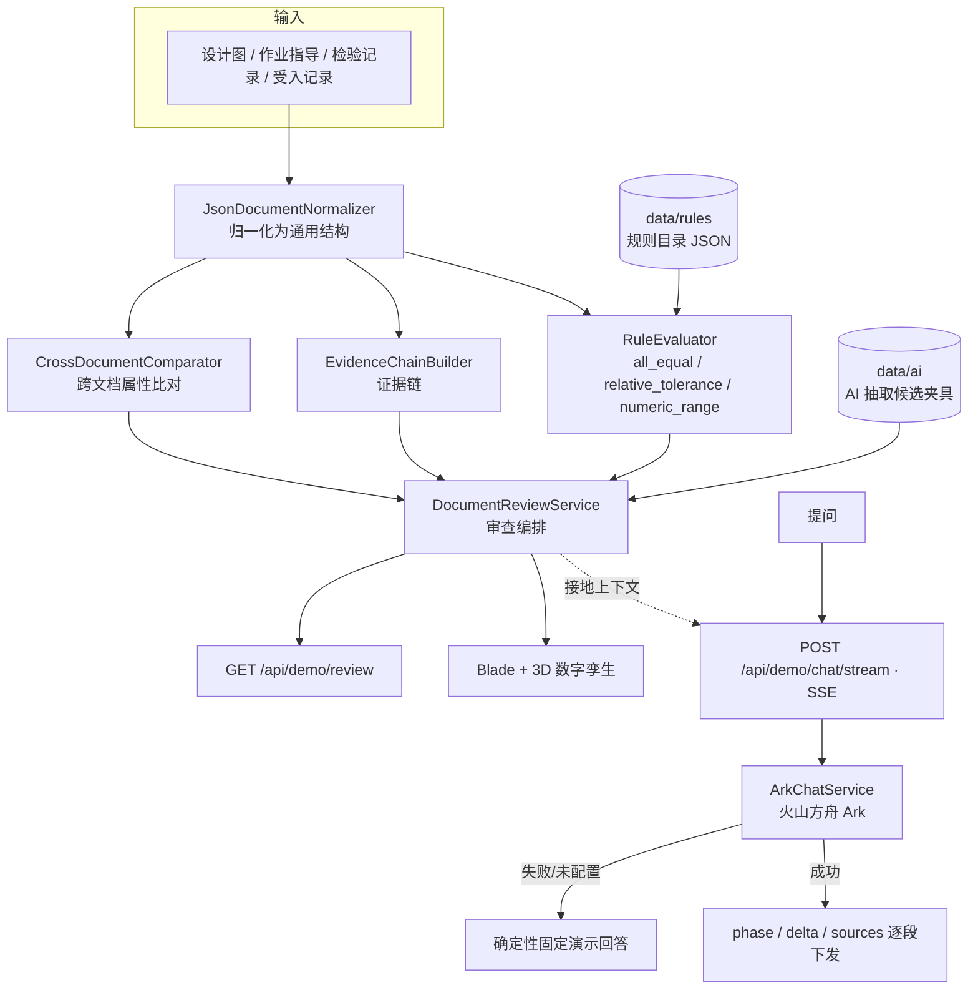

# 技术文档审查 Demo（Technical Document Review Demo）

这是一个用 PHP / Laravel 构建的制造业技术文档审查公开示例：把**设计图、作业指导、检验记录、受入记录**归入同一案件，用**确定性规则与证据链**做判定，AI 只负责候选抽取与解释辅助，**最终判断始终由人完成**。项目用代码与界面两层共同呈现这条责任边界。

> **不把判定权交给 AI。** 在 AI 输出之后，还有规则、证据、人工确认三个独立层级。

**语言 / Language:** [日本語](README.md)・中文（本文件）

---

## 操作演示（约 21 秒）


*滚动浏览数字孪生（3D 工厂 / 齿轮箱 / 文档 / 证据）→ 规则目录 → AI 审查辅助：先显示思考阶段，再通过 SSE 逐字输出带来源 ID 的回答*

---

## 界面一览


*以数字孪生作为空间入口，横向串联设备、工序、文档、规则与证据*


*每条规则都是「输入 → 判断 → 结果 → 证据 → 人工确认」的独立审查单元*


*AI 是带依据 ID 的辅助层；经过思考阶段后通过 SSE 逐字输出回答*

---

## 为什么这样设计

在制造现场，AI 做字段抽取、实体关联很有用，但**如果直接拿它的输出当合格/不合格结论，责任就会变得模糊**。本 Demo 把各层职责拆开：

| 层级 | 职责 | 实现 |
| --- | --- | --- |
| **AI** | 非结构化文档的字段抽取候选、部件关联候选、证据位置候选、说明草稿 | `AiCandidateReader`（候选夹具）、`ArkChatService`（真实模型接入） |
| **确定性规则** | 合格判定、跨文档数值比对、证据链构建 | `RuleEvaluator`、`CrossDocumentComparator`、`EvidenceChainBuilder` |
| **人工（Human Review）** | 对需确认项做最终专业判断与批准 | 界面明确标注 `needs_review` / `human_review_required` |

AI 候选带有 `confidence` 与 `status`（如 `candidate` / `needs_review`），即使置信度很高也不会自动放行。规则在取不到输入值时，默认判为「需确认」而不是「合格」。

---

## 架构



### 数据模型与集成


*JSON 输入经归一化后，由 `DocumentReviewService` 把跨文档比对、规则判定、证据链、AI 候选整合为一个响应。图中的字段、件数、数值均与真实数据（`GET /api/demo/review` 的实测值）一致。*

### 判定流程


*`RuleEvaluator` 在取不到输入值时不会倒向「合格」，而是分支为「需确认」。图中给出 `all_equal` / `relative_tolerance` / `numeric_range` 的判定，以及公开演示三条规则的真实数值（R01：D3≠D2，R02：误差 0.96%≤1.5%，R03：0.24＞上限 0.20）。*

```text
Document（文档）→ AI 抽取候选（仅候选，人工确认）→ Normalize（归一化）
  → Rule / Compare（确定性判定）→ Finding（结构化的需确认项）
  → Evidence（可回溯到 page / table / row）→ Human Review（最终由人判断）
```

---

## 代码导读

| 文件 | 职责 |
| --- | --- |
| `app/Contracts/DocumentNormalizer.php` | 把输入文档整理为通用结构的接口，是替换为 PDF/其他格式的切入点 |
| `app/Services/JsonDocumentNormalizer.php` | JSON 实现，为可选字段提供安全默认值 |
| `app/Services/CrossDocumentComparator.php` | 跨文档比对零件号、材质、润滑油等**通用属性** |
| `app/Services/RuleEvaluator.php` | 基于规则定义的**专业判定**，与通用比对逻辑解耦 |
| `app/Services/RuleCatalog.php` | 以数据（JSON）形式提供规则，新增规则无需改代码 |
| `app/Services/EvidenceChainBuilder.php` | 按 设计图→指导→检验→受入 的顺序构建证据链 |
| `app/Services/DocumentReviewService.php` | 通过依赖注入把上述组件组装起来的编排器 |
| `app/Services/ArkChatService.php` | 真实 LLM 客户端（同时支持非流式/流式），密钥仅在服务端、附带接地上下文 |
| pp/Http/Controllers/DemoChatController.php | JSON 版对话，AI 失败时回退到固定演示回答 |
| pp/Http/Controllers/DemoChatStreamController.php | SSE 版对话，逐段下发 phase / delta / sources / done，失败时也以流式发送固定回答 |
| pp/Services/DemoFallbackResponder.php | 关键词匹配的带依据 ID 固定回答，被 JSON / SSE 两个接口共用 |

### 规则引擎

规则不写死在代码里，`data/rules/public_demo_rules.json` 是唯一定义来源。判定器内置三种通用规则类型：

- `all_equal`：多份文档的值是否完全一致（如图纸改版号 D3 与 D2）
- `relative_tolerance`：设计值与实测值的相对误差是否在容差内（如 1.5%）
- `numeric_range`：实测值是否落在下限/上限区间（如轴承间隙 0.10–0.20 mm）

每条判定结果都带输入值、输出码和证据（`document_id`、`field`、`locator`），可以一路回溯到原文档位置。

---

## AI 的用法与边界

- **接地（Grounding）**：`ArkChatService::groundingContext()` 会把文档、知识库、规则、AI 候选、数字孪生点位附到 prompt，并通过系统提示强制「只以所给资料为依据」「没有依据就明确说无法确认」。知识条目的方法论均带 `sources` 出处（ISO/JIS 公开标准与 NORD 官方手册），与虚构演示记录明确区分。
- **密钥处理**：API Key 只从服务端环境变量读取，绝不发送到浏览器（并有专门测试断言不外泄）。
- **失败兜底**：LLM 未配置、连接失败或超时时，`DemoChatController` 会回退到**带依据 ID 的固定演示回答**，离线也能完整演示。
- **抽取候选是夹具**：`data/ai/assist_candidates.json` 是 `mode: fixture` 的模拟输出，用来展示「AI 候选进入系统后，规则与证据如何介入」的接缝；生产中替换为真实抽取服务即可，契约不变。
- **流式响应**：推理型模型思考较慢，因此对话走 SSE 专用端点 `POST /api/demo/chat/stream`，按 `phase`（思考中）→ `delta`（正文逐字）→ `sources`（依据 ID）→ `done` 的顺序下发；思考阶段就开始有响应，不会让人干等。未配置或失败时也会以流式返回同一份固定演示回答。同时保留非流式的 `POST /api/demo/chat` 作为向后兼容。

---

## 本地运行

```bash
composer install
cp .env.example .env
php artisan key:generate
php artisan serve
# http://localhost:8000/demo
```

环境要求：PHP 8.2+（需启用 `mbstring`、`openssl`、`curl`、`fileinfo`）。

只有要用真实模型驱动 AI 对话时才需要在 `.env` 配置；不配置则使用固定演示回答。

```dotenv
# 按量计费端点（使用独立模型 ID）
ARK_API_KEY=...
ARK_MODEL=<your-model-or-endpoint-id>
ARK_BASE_URL=https://ark.cn-beijing.volces.com/api/v3

# Agent Plan（订阅制）时
ARK_BASE_URL=https://ark.cn-beijing.volces.com/api/plan/v3
ARK_MODEL=ark-code-latest
ARK_TIMEOUT=60
```

> Windows 下若出现 cURL SSL 校验错误（error 60），请下载官方 `cacert.pem`，并在 `php.ini` 的 `curl.cainfo` / `openssl.cafile` 中指定路径。

### API

```text
GET  /api/demo/review     # 文档、规则判定、Finding、证据、AI 候选
GET  /api/demo/knowledge  # 知识库
GET  /api/demo/rules      # 规则目录
POST /api/demo/chat        # AI 审查辅助（JSON，向后兼容，未配置时为固定回答）
POST /api/demo/chat/stream # AI 审查辅助（SSE 流式）
```

### 测试

```bash
composer test
```

测试以**领域行为**为中心：规则容差边界（恰好 1.5% 合格、1.6% 需确认）、区间上下限、输入缺失时回退为「需确认」、证据链顺序、案件级校验、归一化默认值等。

---

## 走向生产的差异（可成长空间）

本 Demo 为公开演示做了有意的简化，真实落地时的主要差异：

- **RAG 化**：当前是把全部数据塞进 prompt；文档增多后需引入切块、检索与引用 ID 对齐。
- **抽取实体化**：把 `assist_candidates.json` 替换为真实抽取服务，并持久化人工确认状态。
- **流式控制**：客户端收到 `done` 后立即结束流，并用 75 秒 Abort 超时防止无限等待；断线重连与断点续传仍未实现。
- **规则版本管理**：规则目录的版本化、有效期与审计日志。
- **存储/缓存**：把每次重读 JSON 改为数据库与缓存。
- **异步化**：抽取与判定走任务队列，支持重算。

---

## 公开范围

这不是真实项目源码，不含客户名、案件名、原始文档、真实业务规则、阈值、坐标与评估数据；文档、部件、数值、规则均为公开演示用的虚构数据；但知识库条目的方法论接地到公开标准（ISO/JIS）与 NORD 官方手册，每条出处都可通过链接核实。部件形式的一部分参考了 NORD MAXXDRIVE 的官方公开资料并已标明出处，但 Demo 内的点位与判定值是与之独立的虚构记录。